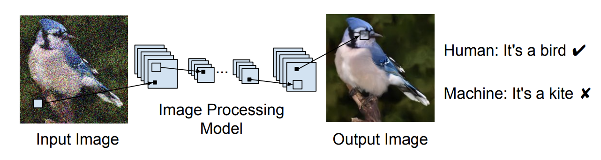
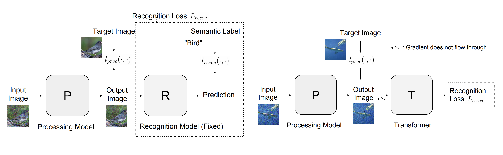

## Exploring Simple and Transferable Recognition-Aware Image Processing

This repo contains the code and instructions to reproduce the results in 

[Exploring Simple and Transferable Recognition-Aware Image Processing](https://arxiv.org/abs/1910.09185). IEEE Transactions on Pattern Analysis and Machine Intelligence (TPAMI).

Zhuang Liu, Hung-Ju Wang, Tinghui Zhou, Zhiqiang Shen, Bingyi Kang, Evan Shelhamer, Trevor Darrell.

<!--  -->

Fig. 1: Image processing aims for images that look visually pleasing for human, but not those accurately recognized by machines. In this work we try to enhance output images’ recognition accuracy.

### Abtract
Recent progress in image recognition has stimulated the deployment of vision systems at an unprecedented scale. As a result, visual data are now often consumed not only by humans but also by machines. Existing image processing methods only optimize for better human perception, yet the resulting images may not be accurately recognized by machines. This can be undesirable, e.g., the images can be improperly handled by search engines or recommendation systems. In this work, we propose simple approaches to improve machine interpretability of processed images: optimizing the recognition loss directly on the image processing network or through an intermediate transforming model. Interestingly, the processing model's ability to enhance recognition quality can transfer when evaluated on models of different architectures, recognized categories, tasks and training datasets. This makes the solutions applicable even when we do not have the knowledge of future recognition models, e.g., if we upload processed images to the Internet. We conduct experiments on multiple image processing tasks, with ImageNet classification and PASCAL VOC detection as recognition tasks. With our simple methods, substantial accuracy gain can be achieved with strong transferability and minimal image quality loss. Through a user study we further show that the accuracy gain can transfer to a black-box, third-party cloud model. Finally, we try to explain this transferability phenomenon by demonstrating the similarities of different models' decision boundaries.

Fig. 2: Left: RA (Recognition-Aware) processing. In addition to the image processing loss, we add a recognition loss using a fixed recognition model R, for the processing model P to optimize. Right: RA with transformer. “Recognition Loss” stands for the dashed box in the left figure. A Transformer T is introduced between the output of P and input of R, to optimize recognition loss. We cut the gradient from recognition loss flowing to P, such that P only optimizes the image processing loss and the image quality is not affected.

### Dependencies
Pytorch 1.5.0, and corresponding version of torchvision (0.6.0). The code could also be run using other recent versions of Pytorch (0.4.0+).

Please install following the official instructions at [Pytorch](https://pytorch.org/).

### Data Preparation
Download and uncompress the ImageNet classification dataset from http://image-net.org/download to `PATH_TO_IMAGENET`, which should contain subfolders `train/` and `val/`.

### Training
The examples given are for a super-resolution task, change `--task` to be `dn/jpeg` for denoising/jpeg-deblocking
The model P is a SRResNet, the model R is a resnet18, see options in train.py
Models, logs and some visualizations will be available in the output folder (`--save-dir`)

Plain Processing
		
    CUDA_VISIBLE_DEVICES=0 python train.py --l 0 --save-dir checkpoints_sr/ --task sr --sr-arch SRResNet --arch resnet18 --mode ra --data PATH_TO_IMAGENET

RA Processing
		
    CUDA_VISIBLE_DEVICES=0 python train.py --l 0.001 --save-dir checkpoints_sr/ --task sr --sr-arch SRResNet --arch resnet18 --mode ra --data PATH_TO_IMAGENET

RA with Transformer
		
    CUDA_VISIBLE_DEVICES=0 python train.py --l 0.01 --save-dir checkpoints_sr_T/ --task sr --sr-arch SRResNet --arch resnet18 --mode ra_transformer --data PATH_TO_IMAGENET

Unsupervised RA
		
    CUDA_VISIBLE_DEVICES=0 python train.py --l 10 --save-dir checkpoints_sr_U/ --task sr --sr-arch SRResNet --arch resnet18 --mode ra_unsupervised --data PATH_TO_IMAGENET

### Evaluation
After training, we could test the resulting image processing models on multiple R architectures (Evaluate transferability on different architectures).

Plain Processing, RA Processing or Unsupervised RA
		
    CUDA_VISIBLE_DEVICES=0 python train.py --cross-evaluate --model-sr PATH_TO_MODEL --task sr --mode ra --data PATH_TO_IMAGENET

RA with Transformer
		
    CUDA_VISIBLE_DEVICES=0 python train.py --cross-evaluate --model-sr PATH_TO_SR_MODEL --model-transformer PATH_TO_TRANSFORMER_MODEL --task sr --mode ra_transform --data PATH_TO_IMAGENET

After evaluation finishes, results will be saved in the same folder as `PATH_TO_MODEL`.

### Pretrained Models
We provide pretrained models of Plain Processing, RA Processing and Unsupervised RA in the following links, for all three tasks.
The recognition model R used as loss is ResNet-18.
| Task       | Models |
| ------------- |  ----------- |
| Super-resolution  | [Google Drive](https://drive.google.com/drive/folders/1U6AGvTyl7BewnwPDxzxSyd6cfxWJ1Tkd?usp=sharing)       |
| Denoising  | [Google Drive](https://drive.google.com/drive/folders/1LyGyMtpqDI2ExVCzL_4inC6X_lndnEvl?usp=sharing)      |
| JPEG-deblocking  | [Google Drive](https://drive.google.com/drive/folders/1E4TDXwFUtJbRx8fNgVkUOhCzL4011CX2?usp=sharing)       |

The models can be used to test models following the commands above.

### Results

The provided pretrained models should produce the results shown in the following tables (ImageNet accuracy %, same as corresponding results in paper).

Note that the R models used to train all P models here is ResNet-18, hence the table is different than Table 1 in paper, but covers the results of Table 1,2 and 10 in paper.

#### Super-resolution

P Model/Evaluation on R | ResNet-18 | ResNet-50 | ResNet-101 | DenseNet-121 | VGG-16
-------|:-------:|:--------:|:--------:|:--------:|:--------:|
Plain Processing |52.6 | 58.8 | 61.9|  57.7 | 50.2
RA Processing |61.8 |66.7 | 68.8|  64.7|  58.2
Unsupervised RA |61.3 | 66.3 |  68.6|    64.5 |  57.3

#### Denoising
P Model/Evaluation on R | ResNet-18 | ResNet-50 | ResNet-101 | DenseNet-121 | VGG-16
-------|:-------:|:--------:|:--------:|:--------:|:--------:|
Plain Processing |61.9 | 68.0 | 69.1 | 66.4 | 60.9
RA Processing |65.1 |70.6 | 71.9 | 69.1 | 63.8
Unsupervised RA |61.7 |67.9 |  69.7 |   66.4 |  60.5

#### JPEG-deblocking
P Model/Evaluation on R | ResNet-18 | ResNet-50 | ResNet-101 | DenseNet-121 | VGG-16
-------|:-------:|:--------:|:--------:|:--------:|:--------:|
Plain Processing |48.2 | 53.8|  56.0|  52.9 | 42.4
RA Processing |57.7 |62.3  |64.3 | 60.7 | 52.8
Unsupervised RA |53.8 |59.1|   62.0|    57.5 |  50.0

Models trained with this code should also produce similar results.

### Contact
You are welcome to open issues or contact liuzhuangthu@gmail.com

